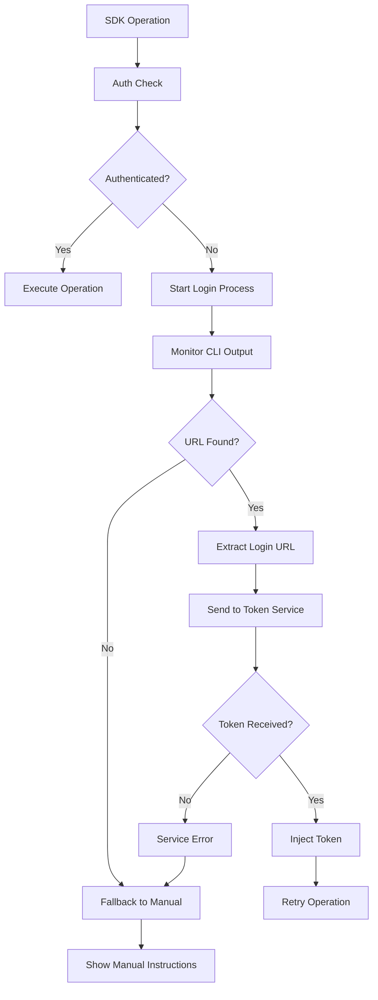

# Claude Code SDK - Automatic Login Design

## Overview

This document details the design for implementing automatic login URL detection and token exchange for the Claude Code SDK Elixir library. The goal is to intercept Claude Code's authentication flow, extract login URLs, exchange them for tokens via a web service, and inject those tokens back into the CLI environment.

## Current Authentication State

### Existing Flow
1. User runs Claude Code SDK operation
2. SDK detects authentication failure via CLI error patterns
3. SDK displays generic "run claude login" message
4. User manually runs `claude login` and copies/pastes browser URL
5. User completes web authentication manually

### Current Implementation Analysis

**AuthChecker Module** (`lib/claude_agent_sdk/auth_checker.ex`):
- **Error Detection**: Lines 387-400 parse CLI errors for authentication failures
- **Status Checking**: Lines 361-378 test authentication via CLI commands
- **Multiple Auth Methods**: Lines 402-417 detect API key, Bedrock, and Vertex configurations
- **Generic Instructions**: Lines 194-201 provide basic "claude login" guidance

**Process Module** (`lib/claude_agent_sdk/process.ex`):
- **Error Formatting**: Lines 256-282 format CLI execution errors
- **JSON Error Parsing**: Lines 284-304 parse JSON error responses

**Current Limitations**:
- No URL detection or extraction
- No automatic token handling
- Relies on manual user intervention

## Proposed Architecture

### 1. Enhanced Authentication Flow



### 2. Core Components

#### A. URL Detection & Extraction

**Enhanced AuthChecker Module**:
```elixir
defmodule ClaudeAgentSdk.AuthChecker do
  @login_url_regex ~r/https:\/\/claude\.ai\/login\?token=[a-zA-Z0-9\-_]+/
  @auth_url_regex ~r/https:\/\/claude\.ai\/auth\/[a-zA-Z0-9\-_\/]+/
  
  def handle_auth_with_url_extraction() do
    case run_claude_login_process() do
      {:ok, login_url} -> 
        ClaudeAgentSdk.TokenService.send_to_token_service(login_url)
      {:error, reason} -> 
        {:error, reason}
    end
  end

  defp run_claude_login_process() do
    # Use erlexec to capture claude login output
    {:ok, pid, os_pid} = :exec.run("claude login", [
      :stdout, :stderr, 
      {:stdout, self()}, 
      {:stderr, self()},
      :monitor
    ])
    
    monitor_for_login_url(pid, os_pid)
  end

  defp monitor_for_login_url(pid, os_pid, timeout \\ 30_000) do
    receive do
      {:stdout, ^os_pid, data} ->
        case extract_login_url(data) do
          {:ok, url} -> {:ok, url}
          :no_url -> monitor_for_login_url(pid, os_pid, timeout)
        end
      {:stderr, ^os_pid, data} ->
        case extract_login_url(data) do
          {:ok, url} -> {:ok, url}
          :no_url -> monitor_for_login_url(pid, os_pid, timeout)
        end
      {:DOWN, ^os_pid, :process, ^pid, reason} ->
        {:error, {:process_exit, reason}}
    after
      timeout -> {:error, :timeout}
    end
  end

  defp extract_login_url(data) do
    # Try multiple URL patterns
    patterns = [@login_url_regex, @auth_url_regex]
    
    Enum.find_value(patterns, :no_url, fn pattern ->
      case Regex.run(pattern, data) do
        [url] -> {:ok, url}
        nil -> nil
      end
    end)
  end
end
```

**Key Features**:
- **Erlexec Integration**: Uses `:exec.run/2` for process control and output capture
- **Real-time Monitoring**: Captures stdout/stderr in real-time
- **Multiple URL Patterns**: Supports various Claude authentication URL formats
- **Timeout Handling**: Prevents hanging on unresponsive CLI commands
- **Process Exit Handling**: Properly handles CLI process termination

#### B. Token Service Integration

**TokenService Module**:
```elixir
defmodule ClaudeAgentSdk.TokenService do
  @service_url Application.get_env(:claude_agent_sdk, :token_service_url, 
                                   "https://your-endpoint.com/auth/exchange")
  @timeout 60_000

  def send_to_token_service(login_url) do
    payload = %{
      login_url: login_url,
      timestamp: System.system_time(:second),
      client_id: generate_client_id()
    }

    case HTTPoison.post(@service_url, 
                       Jason.encode!(payload), 
                       [{"Content-Type", "application/json"}],
                       timeout: @timeout) do
      {:ok, %{status_code: 200, body: body}} ->
        handle_token_response(body)
      {:ok, %{status_code: status, body: body}} ->
        {:error, {:service_error, status, body}}
      {:error, %HTTPoison.Error{reason: reason}} ->
        {:error, {:network_error, reason}}
    end
  end

  defp handle_token_response(body) do
    case Jason.decode(body) do
      {:ok, %{"token" => token, "expires_at" => expires_at}} ->
        inject_token(token, expires_at)
      {:ok, %{"error" => error}} ->
        {:error, {:service_error, error}}
      {:error, _} ->
        {:error, :invalid_response}
    end
  end

  defp inject_token(token, expires_at) do
    # Multiple injection strategies
    strategies = [
      &inject_via_environment/1,
      &inject_via_claude_config/1,
      &inject_via_keychain/1
    ]

    Enum.find_value(strategies, {:error, :all_strategies_failed}, fn strategy ->
      case strategy.(token) do
        :ok -> :ok
        {:error, _} -> nil
      end
    end)
  end

  defp inject_via_environment(token) do
    System.put_env("ANTHROPIC_API_KEY", token)
    :ok
  end

  defp inject_via_claude_config(token) do
    case :exec.run("claude config set api_key #{token}", [:sync]) do
      {:ok, _} -> :ok
      {:error, _} -> {:error, :config_injection_failed}
    end
  end

  defp inject_via_keychain(token) do
    # Platform-specific keychain injection
    case :os.type() do
      {:unix, :darwin} -> inject_macos_keychain(token)
      {:unix, :linux} -> inject_linux_keychain(token)
      _ -> {:error, :unsupported_platform}
    end
  end

  defp generate_client_id() do
    :crypto.strong_rand_bytes(16) |> Base.encode64()
  end
end
```

**Key Features**:
- **Multiple Injection Strategies**: Environment variables, CLI config, system keychain
- **Error Handling**: Comprehensive error handling for network and service issues
- **Timeout Management**: Configurable timeouts for external service calls
- **Security**: Client ID generation for request tracking
- **Platform Support**: Different keychain injection methods per platform

#### C. Web Service Endpoint

**External Service Architecture**:
```python
# Flask/FastAPI endpoint example
from flask import Flask, request, jsonify
from selenium import webdriver
from selenium.webdriver.chrome.options import Options
import asyncio
import time

app = Flask(__name__)

@app.route('/auth/exchange', methods=['POST'])
def exchange_token():
    try:
        data = request.json
        login_url = data.get('login_url')
        client_id = data.get('client_id')
        
        # Validate URL format
        if not is_valid_claude_url(login_url):
            return jsonify({"error": "Invalid URL format"}), 400
        
        # Complete authentication flow
        token = complete_auth_flow(login_url)
        
        if token:
            return jsonify({
                "token": token,
                "expires_at": get_token_expiration(token),
                "client_id": client_id
            })
        else:
            return jsonify({"error": "Authentication failed"}), 401
            
    except Exception as e:
        return jsonify({"error": str(e)}), 500

def complete_auth_flow(login_url):
    """Complete Claude authentication flow using headless browser"""
    chrome_options = Options()
    chrome_options.add_argument("--headless")
    chrome_options.add_argument("--no-sandbox")
    chrome_options.add_argument("--disable-dev-shm-usage")
    
    driver = webdriver.Chrome(options=chrome_options)
    
    try:
        # Navigate to login URL
        driver.get(login_url)
        
        # Wait for authentication completion
        # This would need to be customized based on Claude's actual flow
        time.sleep(5)
        
        # Extract token from cookies/localStorage/sessionStorage
        token = extract_auth_token(driver)
        
        return token
        
    finally:
        driver.quit()

def extract_auth_token(driver):
    """Extract authentication token from browser session"""
    # Method 1: Check localStorage
    token = driver.execute_script("return localStorage.getItem('auth_token');")
    if token:
        return token
    
    # Method 2: Check sessionStorage
    token = driver.execute_script("return sessionStorage.getItem('auth_token');")
    if token:
        return token
    
    # Method 3: Check cookies
    cookies = driver.get_cookies()
    for cookie in cookies:
        if cookie['name'] in ['auth_token', 'session_token', 'claude_token']:
            return cookie['value']
    
    return None

def is_valid_claude_url(url):
    """Validate that URL is from Claude domain"""
    import re
    pattern = r'^https://claude\.ai/(login|auth)/'
    return re.match(pattern, url) is not None
```

**Service Features**:
- **Headless Browser**: Automated authentication completion
- **Token Extraction**: Multiple methods for token retrieval
- **URL Validation**: Security checks for Claude domain
- **Error Handling**: Comprehensive error responses
- **Async Support**: Can be extended for high-concurrency scenarios

### 3. Enhanced Integration

**Main Authentication Orchestrator**:
```elixir
defmodule ClaudeAgentSdk.EnhancedAuth do
  require Logger

  def ensure_authenticated(opts \\ []) do
    auto_login = Keyword.get(opts, :auto_login, true)
    
    case ClaudeAgentSdk.AuthChecker.check_cli_auth_status() do
      :ok -> 
        :ok
      {:error, :not_authenticated} when auto_login -> 
        handle_automatic_login(opts)
      {:error, :not_authenticated} -> 
        {:error, :not_authenticated}
      {:error, reason} ->
        {:error, reason}
    end
  end

  defp handle_automatic_login(opts) do
    Logger.info("Authentication required. Initiating automatic login...")
    
    case ClaudeAgentSdk.AuthChecker.handle_auth_with_url_extraction() do
      :ok -> 
        Logger.info("Automatic authentication successful!")
        verify_authentication()
      {:error, reason} ->
        Logger.warning("Automatic authentication failed: #{inspect(reason)}")
        handle_fallback(opts)
    end
  end

  defp verify_authentication() do
    # Verify that authentication actually worked
    case ClaudeAgentSdk.AuthChecker.check_cli_auth_status() do
      :ok -> :ok
      {:error, reason} -> {:error, {:verification_failed, reason}}
    end
  end

  defp handle_fallback(opts) do
    if Keyword.get(opts, :fallback_to_manual, true) do
      display_manual_instructions()
      {:error, :manual_intervention_required}
    else
      {:error, :automatic_login_failed}
    end
  end

  defp display_manual_instructions() do
    IO.puts("""
    
    Automatic authentication failed. Please authenticate manually:
    
    1. Run: claude login
    2. Copy the URL from the output
    3. Open the URL in your browser
    4. Complete the authentication process
    
    """)
  end
end
```

## Implementation Strategy

### Phase 1: URL Detection
1. **Enhance AuthChecker**: Add URL extraction capabilities
2. **Integrate Erlexec**: Implement process monitoring
3. **Add Pattern Matching**: Support multiple URL formats
4. **Testing**: Verify URL detection with various CLI versions

### Phase 2: Token Service
1. **HTTP Client Setup**: Configure HTTPoison for external calls
2. **Token Injection**: Implement multiple injection strategies
3. **Error Handling**: Comprehensive error management
4. **Configuration**: Make service URL configurable

### Phase 3: Web Service
1. **Service Development**: Create token exchange endpoint
2. **Browser Automation**: Implement headless authentication
3. **Security**: Add URL validation and rate limiting
4. **Deployment**: Deploy to reliable hosting platform

### Phase 4: Integration
1. **Orchestration**: Combine all components
2. **Fallback Handling**: Graceful degradation to manual process
3. **Testing**: End-to-end integration testing
4. **Documentation**: Update usage instructions

## Configuration

### SDK Configuration
```elixir
# config/config.exs
config :claude_agent_sdk,
  token_service_url: "https://your-endpoint.com/auth/exchange",
  auto_login: true,
  fallback_to_manual: true,
  login_timeout: 60_000,
  token_injection_strategies: [:environment, :claude_config, :keychain]
```

### Environment Variables
```bash
# Optional: Override token service URL
export CLAUDE_SDK_TOKEN_SERVICE_URL="https://custom-endpoint.com/auth"

# Optional: Disable automatic login
export CLAUDE_SDK_AUTO_LOGIN=false

# Optional: Set custom timeout
export CLAUDE_SDK_LOGIN_TIMEOUT=120000
```

## Error Handling

### Error Types
- **`:timeout`**: URL detection timeout
- **`:process_exit`**: CLI process terminated unexpectedly
- **`:network_error`**: Token service unreachable
- **`:service_error`**: Token service returned error
- **`:invalid_response`**: Malformed service response
- **`:injection_failed`**: Token injection failed
- **`:verification_failed`**: Authentication verification failed

### Error Recovery
1. **Retry Logic**: Automatic retries for transient failures
2. **Fallback Strategies**: Multiple token injection methods
3. **Manual Fallback**: Graceful degradation to manual process
4. **Logging**: Comprehensive error logging for debugging

## Security Considerations

### Token Handling
- **Secure Storage**: Use system keychain when available
- **Environment Isolation**: Scope environment variables appropriately
- **Token Expiration**: Respect token expiration times
- **Secure Transmission**: HTTPS for all external communications

### URL Validation
- **Domain Validation**: Ensure URLs are from Claude domain
- **Pattern Matching**: Validate URL structure
- **Timeout Limits**: Prevent hanging on malicious URLs

### Service Security
- **Rate Limiting**: Prevent abuse of token service
- **Input Validation**: Sanitize all inputs
- **Error Disclosure**: Avoid leaking sensitive information
- **Logging**: Audit all authentication attempts

## Testing Strategy

### Unit Tests
- URL extraction pattern matching
- Token injection methods
- Error handling scenarios
- Configuration validation

### Integration Tests
- End-to-end authentication flow
- Service communication
- Fallback mechanisms
- Cross-platform compatibility

### Performance Tests
- Authentication timing
- Service response times
- Resource usage
- Concurrent authentication

## Future Enhancements

### Potential Improvements
1. **Caching**: Cache tokens until expiration
2. **Background Refresh**: Automatic token refresh
3. **Multiple Services**: Support multiple token services
4. **Metrics**: Authentication success/failure metrics
5. **GUI Integration**: Desktop notification support

### Monitoring
- **Health Checks**: Service availability monitoring
- **Performance Metrics**: Response time tracking
- **Error Rates**: Authentication failure tracking
- **Usage Analytics**: Authentication frequency patterns

## Conclusion

This design provides a comprehensive solution for automatic Claude Code authentication that:

1. **Leverages Erlexec**: Uses proven process control capabilities
2. **Maintains Compatibility**: Works alongside existing manual process
3. **Provides Fallbacks**: Graceful degradation when automation fails
4. **Ensures Security**: Proper token handling and validation
5. **Enables Scalability**: Configurable and extensible architecture

The implementation can be developed incrementally, starting with URL detection and building up to full automation, ensuring each component is thoroughly tested before integration.


  Claude Code Authentication Storage on Ubuntu 24

  Primary Authentication File

  ~/.claude/.credentials.json
  - Contains: OAuth tokens (access_token, refresh_token, expiration)
  - Permissions: 600 (read/write owner only)
  - Format: JSON with claudeAiOauth object

  Configuration Files

  ~/.claude/settings.json          # User permissions, model settings
  ~/.config/claude-code/config.json # MCP server configurations
  ~/.claude.json                   # Main application state (1.2MB!)

  Session Storage

  ~/.claude/__store.db             # SQLite database (5.5MB)
  ~/.claude/projects/              # Project-specific data
  ~/.claude/statsig/               # Analytics data
  ~/.claude/todos/                 # Todo storage

  Cache & Logs

  ~/.cache/claude-cli-nodejs/      # MCP server logs

  How to Invalidate Authentication

  Method 1: Remove Credentials (Recommended)

  rm ~/.claude/.credentials.json

  Method 2: Nuclear Option (Full Reset)

  rm -rf ~/.claude/
  rm -rf ~/.config/claude-code/
  rm -rf ~/.cache/claude-cli-nodejs/

  Method 3: Selective Cleanup

  # Just auth + session data
  rm ~/.claude/.credentials.json
  rm ~/.claude/__store.db

  For Your Elixir SDK

  You can add this function to force re-authentication:

  defmodule ClaudeAgentSdk.AuthInvalidator do
    def invalidate_auth() do
      credentials_file = Path.join([System.user_home!(), ".claude", ".credentials.json"])

      case File.rm(credentials_file) do
        :ok ->
          IO.puts("Authentication invalidated. Next operation will require re-authentication.")
          :ok
        {:error, :enoent} ->
          IO.puts("No authentication found to invalidate.")
          :ok
        {:error, reason} ->
          {:error, reason}
      end
    end
  end

  The key file is ~/.claude/.credentials.json - removing this will force Claude Code to re-authenticate on the next operation.
