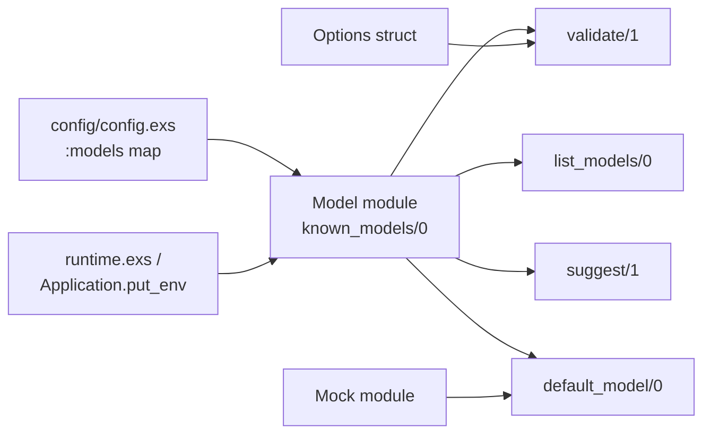

# Model Configuration

The SDK uses a **config-driven model registry** so that new Claude models can be
added without recompiling application code.  All model validation, listing, and
suggestion logic reads from `Application` config at runtime.

## Default Configuration

The built-in defaults are set in `config/config.exs`:

```elixir
config :claude_agent_sdk, :models, %{
  short_forms: %{
    "opus"       => "opus",
    "sonnet"     => "sonnet",
    "haiku"      => "haiku",
    "sonnet[1m]" => "sonnet[1m]"
  },
  full_ids: %{
    "claude-opus-4-6"                => "claude-opus-4-6",
    "claude-sonnet-4-5-20250929"     => "claude-sonnet-4-5-20250929",
    "claude-haiku-4-5-20251001"      => "claude-haiku-4-5-20251001",
    "claude-sonnet-4-5-20250929[1m]" => "claude-sonnet-4-5-20250929[1m]"
  },
  default: "haiku"
}
```

| Key | Description |
|-----|-------------|
| `short_forms` | CLI-friendly aliases (`"opus"`, `"sonnet"`, etc.) |
| `full_ids` | Versioned model identifiers as published by Anthropic |
| `default` | The model used when none is specified |

Both maps use `name => name` identity mappings because the Claude CLI
accepts these strings directly and handles any internal resolution.

## Using Models

### In Options

```elixir
# Short form
options = %ClaudeAgentSDK.Options{model: "opus"}

# Full ID
options = %ClaudeAgentSDK.Options{model: "claude-opus-4-6"}
```

### In Agents

```elixir
agent = ClaudeAgentSDK.Agent.new(
  description: "Research specialist",
  prompt: "You excel at research",
  model: "sonnet"
)
```

### Validation

```elixir
{:ok, "opus"} = ClaudeAgentSDK.Model.validate("opus")
{:error, :invalid_model} = ClaudeAgentSDK.Model.validate("gpt-5")
```

### Listing

```elixir
ClaudeAgentSDK.Model.list_models()
# => ["claude-haiku-4-5-20251001", "claude-opus-4-6", "haiku", "opus", ...]

ClaudeAgentSDK.Model.short_forms()
# => ["haiku", "opus", "sonnet", "sonnet[1m]"]

ClaudeAgentSDK.Model.full_ids()
# => ["claude-haiku-4-5-20251001", "claude-opus-4-6", ...]
```

### Suggestions

When a user provides an invalid model name the SDK can suggest corrections:

```elixir
ClaudeAgentSDK.Model.suggest("opuss")
# => ["opus"]
```

## Adding Custom Models at Runtime

If Anthropic ships a new model before the SDK publishes an update, add it
at boot time without waiting for a library release:

```elixir
# In config/runtime.exs or Application.start callback:
config = Application.get_env(:claude_agent_sdk, :models)

updated =
  config
  |> Map.update!(:full_ids, &Map.put(&1, "claude-opus-5-20260301", "claude-opus-5-20260301"))
  |> Map.update!(:short_forms, &Map.put(&1, "opus5", "opus5"))

Application.put_env(:claude_agent_sdk, :models, updated)
```

After this, `Model.validate("opus5")` and `Model.validate("claude-opus-5-20260301")`
will both return `{:ok, ...}`.

## Overriding the Default Model

```elixir
config = Application.get_env(:claude_agent_sdk, :models)
Application.put_env(:claude_agent_sdk, :models, %{config | default: "opus"})
```

## Thinking Tokens

Extended thinking is controlled by the `max_thinking_tokens` option, which
accepts any positive integer:

```elixir
options = %ClaudeAgentSDK.Options{
  model: "sonnet",
  max_thinking_tokens: 8192
}
```

There are no hardcoded budget values or reasoning-level strings in the SDK.
The value is passed directly to the Claude CLI as `--max-thinking-tokens <N>`.

## Testing

Test code uses `ClaudeAgentSDK.Test.ModelFixtures` to avoid hardcoding model
strings in assertions:

```elixir
import ClaudeAgentSDK.Test.ModelFixtures

test "handles message start" do
  event = %{"type" => "message_start", "message" => %{"model" => test_model()}}
  # ...
end
```

| Helper | Value | Purpose |
|--------|-------|---------|
| `test_model()` | `"test-model-alpha"` | Primary fixture model |
| `test_model_alt()` | `"test-model-beta"` | When two distinct models are needed |
| `real_default_model()` | Reads live config | Tests that need an actual registry entry |

## Architecture



The `Model` module never holds state of its own.  Every call reads from
`Application.get_env(:claude_agent_sdk, :models)`, making the registry
fully dynamic at runtime.
